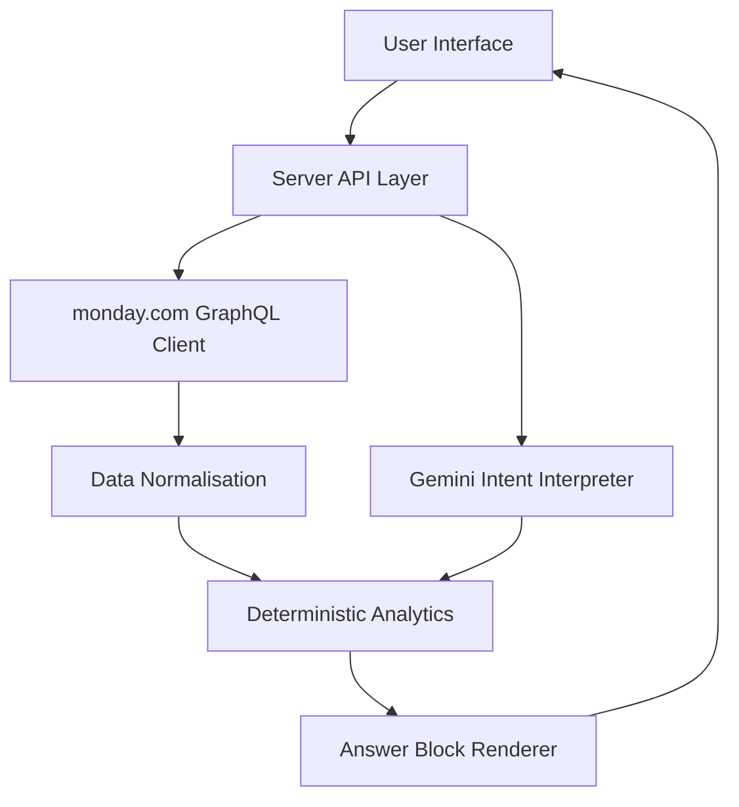

# Skylark BI

A conversational business-intelligence application that connects to live monday.com boards and allows users to ask natural-language questions about sales pipeline, work orders, billing, collections, execution and data quality.

The application combines Gemini-based intent understanding with deterministic business calculations. Gemini interprets the question, while all numerical results are calculated directly from monday.com board data.

## Live Application

* **Hosted application:** [Open Skylark BI](LIVE_VERCEL_URL)
* **GitHub repository:** [View source code](GITHUB_REPOSITORY_URL)

## Assignment Overview

The application uses two monday.com boards:

1. **Deal Funnel** — sales pipeline, deal stages, probabilities, owners, sectors and deal values.
2. **Work Order Tracker** — execution, delivery dates, contracted value, billing, collections and receivables.

Users can ask questions such as:

* What is our current open pipeline?
* Which owner controls the largest open pipeline?
* What is the deal win rate?
* Which work orders are overdue?
* How much has been billed and collected?
* Compare Mining pipeline with Mining work-order performance.
* What are the largest data-quality problems?
* Prepare a leadership update.

Responses can contain explanatory text, KPI cards, charts, tables, ranked lists and relevant data-quality caveats.

## Key Features

* Live monday.com GraphQL API integration
* Gemini-powered natural-language intent interpretation
* Deterministic business calculations
* Rule-based fallback when Gemini is unavailable
* Sales-pipeline and win-rate analysis
* Work-order execution and overdue analysis
* Billing, collection and receivable reporting
* Cross-board sector-level comparisons
* KPI cards, graphs, tables and structured visualisations
* Missing-value and invalid-record handling
* Negative financial-anomaly reporting
* Conversational clarification for ambiguous questions
* Responsive ChatGPT-style interface
* Indian currency formatting
* Conversation history
* Connection, freshness and Gemini-status indicators
* Public Vercel deployment

## Architecture



### Component responsibilities

#### User interface

Provides:

* Chat conversation
* Suggested questions
* Clarification choices
* KPI cards
* Charts
* Tables
* Caveat panels
* Loading and error states
* Responsive desktop and mobile layouts

#### Server API layer

Responsible for:

* Protecting API credentials
* Receiving user questions
* Fetching monday.com data
* Calling Gemini
* Selecting the correct analytics operation
* Returning structured response data
* Activating deterministic fallback when required

#### Gemini intent interpreter

Gemini is used to:

* Understand natural-language questions
* Handle paraphrased and misspelled questions
* Extract filters such as sector, status, owner and date
* Identify the requested metric
* Request clarification when a question is ambiguous

Gemini is not used as the source of numerical truth. It does not invent or manually calculate business values.

Configured model:

```env
GEMINI_MODEL=gemini-3.1-flash-lite
```

#### monday.com client

The monday.com client:

* Sends authenticated GraphQL requests
* Retrieves board metadata, columns and items
* Supports pagination
* Maps monday.com column IDs to business fields
* Returns live board values to the analytics layer

#### Data normalisation

The normalisation layer handles:

* Empty and null values
* Numeric strings
* Indian currency values
* Status capitalisation
* Leading and trailing spaces
* Inconsistent text labels
* Repeated-header or malformed imported rows
* Date parsing
* Month-only text values
* Missing execution statuses
* Missing probable end dates
* Negative financial values

#### Deterministic analytics

All business metrics are calculated in application code, including:

* Open pipeline
* Known-value coverage
* Win rate
* Pipeline by owner
* Pipeline by sector
* Pipeline by closure probability
* Contracted value
* Billed value
* Collected value
* Collection rate
* Positive receivables
* Overdue work orders
* Cross-board sector comparisons
* Data-quality counts

#### Answer renderer

The frontend converts structured results into ordered answer blocks:

* Text
* KPI cards
* Charts
* Tables
* Insights
* Clarification options
* Caveats

The visual format is selected according to the question and available data.

## Data Flow

1. The user enters a question.
2. The frontend sends the question to the server API.
3. The server fetches the latest items from the configured monday.com boards.
4. Raw monday.com values are mapped and normalised.
5. Gemini interprets the user’s intent and requested filters.
6. Deterministic analytics calculate the result.
7. Data-quality caveats are attached where relevant.
8. The API returns structured answer blocks.
9. The frontend renders text, KPIs, charts or tables.
10. If Gemini fails, supported queries use deterministic fallback routing.

## Technology Overview

* **Frontend:** React and TypeScript
* **Styling:** Existing project styling system
* **Charts:** Existing project chart library
* **API layer:** Server-side JavaScript/TypeScript endpoints
* **Business data:** monday.com GraphQL API
* **AI model:** Gemini 3.1 Flash-Lite
* **Hosting:** Vercel
* **Version control:** GitHub

## monday.com Configuration

### 1. Create the boards

Create or import the following two boards:

* `Deal funnel Data`
* `Work_Order_Tracker Data`

The names may differ, but their IDs must be configured correctly in the environment variables.

### 2. Deal Funnel board columns

| Business field       | Recommended monday.com type |
| -------------------- | --------------------------- |
| Deal Name            | Item name                   |
| Owner code           | Text                        |
| Client Code          | Text                        |
| Deal Status          | Status                      |
| Close Date (A)       | Date                        |
| Closure Probability  | Status                      |
| Masked Deal value    | Numbers                     |
| Tentative Close Date | Date                        |
| Deal Stage           | Dropdown                    |
| Product deal         | Dropdown                    |
| Sector/service       | Dropdown                    |
| Created Date         | Date                        |

### 3. Work Order board columns

| Business field                    | Recommended monday.com type |
| --------------------------------- | --------------------------- |
| Deal name masked                  | Item name                   |
| Customer Name Code                | Text                        |
| Serial #                          | Text                        |
| Nature of Work                    | Dropdown                    |
| Last executed month               | Text                        |
| Execution Status                  | Status                      |
| Data Delivery Date                | Date                        |
| Date of PO/LOI                    | Date                        |
| Document Type                     | Dropdown or Text            |
| Probable Start Date               | Date                        |
| Probable End Date                 | Date                        |
| BD/KAM Personnel code             | Text                        |
| Sector                            | Dropdown                    |
| Type of Work                      | Dropdown                    |
| Platform included                 | Dropdown or Text            |
| Last invoice date                 | Date                        |
| Latest invoice number             | Text                        |
| Contracted amount excluding GST   | Numbers                     |
| Contracted amount including GST   | Numbers                     |
| Billed value excluding GST        | Numbers                     |
| Billed value including GST        | Numbers                     |
| Collected amount including GST    | Numbers                     |
| Amount to be billed excluding GST | Numbers                     |
| Amount to be billed including GST | Numbers                     |
| Amount Receivable                 | Numbers                     |
| AR Priority account               | Status                      |
| Invoice Status                    | Status                      |
| Actual Billing Month              | Text                        |
| Actual Collection Month           | Text                        |
| WO Status                         | Status                      |
| Collection Status                 | Status                      |
| Collection Date                   | Date or Text                |
| Billing Status                    | Status                      |

Month-only fields may remain Text columns. The normalisation layer must not interpret a missing month as zero.

### 4. Obtain a monday.com API token

1. Sign in to monday.com.
2. Click the profile picture in the upper-right corner.
3. Select **Developers**.
4. Open **API token** or **My access tokens**.
5. Copy the personal API token.
6. Ensure the token owner can open both boards in the monday.com interface.

Never commit the token to GitHub.

Official documentation:

* [monday.com API authentication](https://developer.monday.com/api-reference/docs/authentication)
* [monday.com API getting started](https://developer.monday.com/api-reference/docs/getting-started)

### 5. Obtain board IDs

Open each board in monday.com.

A board URL normally contains its numeric ID:

```text
https://your-account.monday.com/boards/1234567890
```

In this example:

```text
1234567890
```

is the board ID.

Record the IDs of both boards.

### 6. Configure environment variables

Create `.env.local` in the project root:

```env
MONDAY_API_TOKEN=your_monday_personal_api_token
MONDAY_DEAL_BOARD_ID=your_deal_funnel_board_id
MONDAY_WORK_ORDER_BOARD_ID=your_work_order_board_id

GEMINI_API_KEY=your_gemini_api_key
GEMINI_MODEL=gemini-3.1-flash-lite
```

The environment-variable names must match the names referenced by the source code. If the repository uses different names, update this section and `.env.example` to match the implementation exactly.

Do not use browser-exposed prefixes such as `VITE_` or `NEXT_PUBLIC_` for secret tokens.

### 7. Verify monday.com connectivity

After starting the application:

1. Open the application.
2. Confirm that the Monday connection indicator is green.
3. Confirm that the data-refresh timestamp is displayed.
4. Ask:

```text
How many work orders are available?
```

Expected result for the supplied dataset:

```text
176 work orders
```

If the connection fails:

* Verify the token.
* Verify both board IDs.
* Confirm that the token owner has access to both boards.
* Confirm that the variable names match the source code.
* Restart the local server after changing `.env.local`.
* Redeploy after changing Vercel environment variables.

## Gemini Configuration

### 1. Create an API key

Create a Gemini API key through Google AI Studio.

### 2. Add the environment variables

```env
GEMINI_API_KEY=your_gemini_api_key
GEMINI_MODEL=gemini-3.1-flash-lite
```

### 3. Verify Gemini

Ask a paraphrased question that is not one of the exact suggested queries:

```text
Among open deals with known values, which owner controls the most pipeline and what share is it?
```

For the supplied dataset, the expected result is:

```text
OWNER_003 controls ₹49,78,30,748, representing 72.3% of known open pipeline.
```

The header must show:

```text
Gemini active
```

If it shows `Fallback mode`:

* Verify `GEMINI_API_KEY`.
* Verify the model name.
* Inspect server logs for the sanitised failure category.
* Confirm that the correct Gemini SDK response field is being read.
* Redeploy after changing environment variables.

## Local Development

### Prerequisites

* Node.js 18 or later
* npm
* Git
* monday.com account
* monday.com personal API token
* Gemini API key

### Installation

```bash
git clone <GITHUB_REPOSITORY_URL>
cd <REPOSITORY_FOLDER>
npm install
```

Create the local environment file:

```bash
cp .env.example .env.local
```

Populate `.env.local` with the required credentials and board IDs.

Start the development server:

```bash
npm run dev
```

Open the local URL printed in the terminal.

### Production build

```bash
npm run build
```

Run the production preview if the project provides a preview script:

```bash
npm run preview
```

## Vercel Deployment

### GitHub deployment

1. Push the repository to GitHub.
2. Sign in to [Vercel](https://vercel.com) using GitHub.
3. Select **Add New → Project**.
4. Import the GitHub repository.
5. Select the folder containing `package.json` as the Root Directory.
6. Keep the detected framework and build settings.
7. Add all required environment variables.
8. Enable the variables for Production and Preview.
9. Click **Deploy**.
10. Test the generated public `vercel.app` link in an incognito window.

### Required Vercel environment variables

```env
MONDAY_API_TOKEN
MONDAY_DEAL_BOARD_ID
MONDAY_WORK_ORDER_BOARD_ID
GEMINI_API_KEY
GEMINI_MODEL
```

Environment-variable changes apply only to a new deployment. Redeploy after adding or changing a variable.

After GitHub is connected, pushing changes to the production branch automatically triggers another Vercel deployment while preserving the same production URL.

## Metric Definitions

### Open pipeline

```text
Sum of non-null Masked Deal values where normalized Deal Status = Open
```

Missing values are excluded from the sum and reported separately.

### Known-value coverage

```text
Open deals with known values ÷ total open deals
```

### Win rate

```text
Won ÷ (Won + Dead)
```

Open, On Hold, missing-status and malformed rows are excluded.

### Confirmed overdue work order

A work order is confirmed overdue when:

```text
Probable End Date < as-of date
AND Execution Status is present
AND normalized Execution Status != Completed
```

A past-date record with a missing execution status is reported separately as status unknown.

### Collection rate

```text
Collected Amount Including GST ÷ Billed Value Including GST
```

### Positive receivables

Only positive receivable values are included in the headline receivable total. Negative values are reported separately as anomalies.

## Data Resilience

The supplied data intentionally contains missing, inconsistent and anomalous values.

The application:

* Trims text values.
* Normalises status capitalisation.
* Parses valid dates.
* Preserves unknown values as unknown.
* Excludes malformed repeated-header rows from business calculations.
* Excludes null financial values from sums.
* Reports calculation coverage.
* Separates missing status from confirmed incomplete status.
* Separates negative anomalies from positive financial totals.
* Avoids row-level joins based only on masked deal names.
* Communicates relevant caveats in each response.

### Important source-data caveats

For the supplied files:

* Two Deal Funnel rows contain malformed repeated-header data.
* Some deal values are missing.
* Some work orders have missing probable end dates.
* Some work orders have missing execution statuses.
* Collection date and collection month fields are largely incomplete.
* Negative amount-to-be-billed and receivable values exist.
* Masked deal names are not unique identifiers.

## Cross-Board Comparison Strategy

Deal names are masked and may repeat. A direct row-level join between the Deal Funnel and Work Order boards could produce incorrect matches.

Cross-board comparisons are therefore performed at an aggregate level using stable dimensions such as:

* Sector
* Owner code, when semantically compatible
* Status
* Time period, when valid dates are available

This avoids presenting false record-level relationships.

## Assumptions

* monday.com is the live source of truth.
* Board schemas remain compatible with the configured field mappings.
* Masked values are safe to display for the assignment.
* Missing values are unknown, not zero.
* The current date or explicitly requested as-of date is used for overdue calculations.
* Rupee values are displayed using Indian number formatting.
* Gemini interprets intent but does not calculate authoritative totals.
* Personal API-token authentication is acceptable for this prototype.
* Sector-level aggregation is safer than masked-name joins.

## Trade-offs

### Gemini plus deterministic calculations

Gemini provides flexible natural-language understanding, while deterministic code provides repeatable numerical results.

This reduces hallucinated totals but requires predefined analytics operations.

### Live board access versus caching

The application prioritises current monday.com values. This can increase response time and API usage compared with a cached data warehouse.

### Personal token versus OAuth

A personal monday.com API token is faster for an assignment prototype. A production multi-user application should use OAuth and user-specific permissions.

### Aggregate cross-board analysis

Sector-level comparisons are reliable with masked data, but they cannot explain individual deal-to-work-order conversion without a stable shared identifier.

### Fallback mode

Fallback keeps core questions available when Gemini fails, but it supports fewer natural-language variations than the Gemini route.

## Security

* API keys and tokens are stored only in server-side environment variables.
* Secrets are never returned to the browser.
* `.env` and `.env.local` must be excluded from Git.
* monday.com and Gemini requests are performed server-side.
* Logs must never contain full tokens.
* Production errors expose only sanitised failure categories.
* User questions cannot request or reveal credentials.
* Tokens should be rotated if accidentally exposed.

Recommended `.gitignore` entries:

```gitignore
.env
.env.local
.env.*.local
.vercel
node_modules
dist
```

## Example Validation Queries

### Sales pipeline

```text
Using only open deals, what is the known-value pipeline, missing-value count and coverage percentage?
```

Expected for the supplied dataset:

```text
49 open deals
₹68,81,52,293 known-value pipeline
2 missing values
95.9% coverage
```

### Win rate

```text
Calculate win rate using only Won and Dead deals.
```

Expected:

```text
165 Won
127 Dead
56.5% win rate
```

### Overdue execution

```text
As of 2026-08-30, count work orders with a past Probable End Date and a present non-completed Execution Status. Report missing statuses separately.
```

Expected:

```text
48 confirmed overdue
1 past-date record with missing execution status
19 records with missing probable end date
```

### Billing and collections

```text
Report contracted excluding GST, billed including GST, collected including GST and collection rate.
```

Expected:

```text
Contracted excl. GST: ₹21,16,49,409
Billed incl. GST: ₹12,67,19,936
Collected incl. GST: ₹9,04,28,188
Collection rate: 71.4%
```

## Testing

Before submission, verify:

```bash
npm run build
```

Also run the repository’s configured lint, type-check and test scripts when present:

```bash
npm run lint
npm run typecheck
npm test
```

Manual checks:

* Application loads using the public URL.
* No Vercel authentication is required.
* monday.com shows connected.
* Gemini shows active after a successful request.
* Fallback mode is clearly identified.
* Suggested questions work.
* Clarification options work.
* KPI cards display the requested metric.
* Charts resize correctly.
* Tables do not cause page-level horizontal scrolling.
* Currency uses Indian number formatting.
* Missing values are not converted to zero.
* Secrets are absent from browser source and network responses.
* Mobile layout has no horizontal overflow.

## AI Tools Used

AI tools were permitted for this assignment.

Tools used during development:

* **ChatGPT** — requirements analysis, architecture discussion, data validation and test-case design
* **OpenAI Codex** — code generation, refactoring, debugging and UI implementation
* **Gemini** — runtime natural-language intent interpretation
* **GitHub** — version control
* **Vercel** — automated deployment

All generated code and calculations were reviewed and tested. I can explain the architecture, data flow, business definitions and technical decisions used in the implementation.

## Challenges

### Messy imported data

The Excel files contain nulls, malformed rows, inconsistent labels and negative financial values.

Resolution:

* Added normalisation.
* Kept missing values distinct from zero.
* Added calculation coverage and caveats.
* Separated negative anomalies.

### Ambiguous business language

Terms such as revenue, energy sector, total records and incomplete work orders can have multiple definitions.

Resolution:

* Added clarification questions.
* Made metric definitions explicit.
* Added clickable clarification options.

### Masked and repeated names

Deal names cannot safely identify a unique deal across both boards.

Resolution:

* Avoided unsafe row-level joins.
* Used sector-level aggregate comparisons.

### Gemini availability

API keys, quotas, parsing failures or network errors can prevent Gemini from responding.

Resolution:

* Added a deterministic fallback.
* Added sanitised error categories.
* Kept numerical calculations independent of Gemini.
* Exposed active/fallback status in the UI.


## Author

**Rethika K Jegan**

Full Stack Developer Assignment — Skylark Drones
